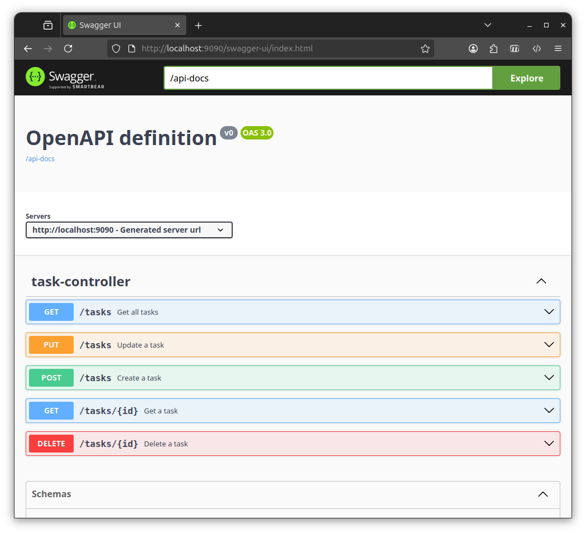
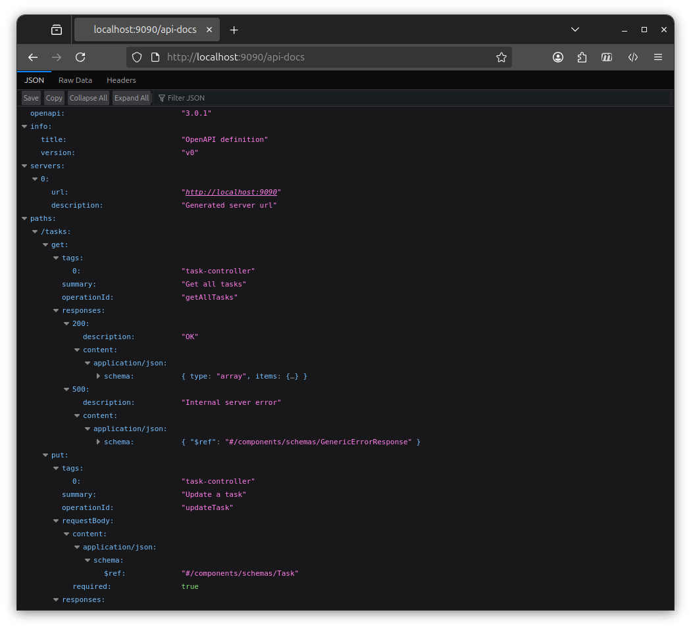
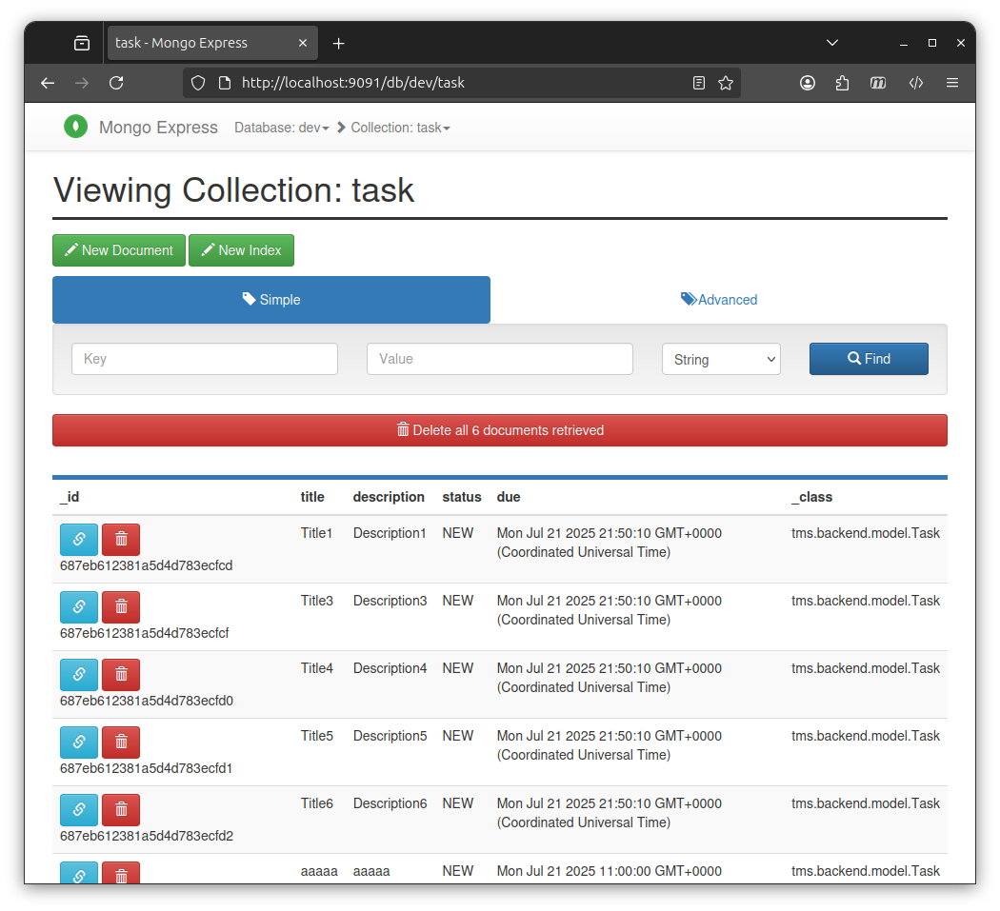
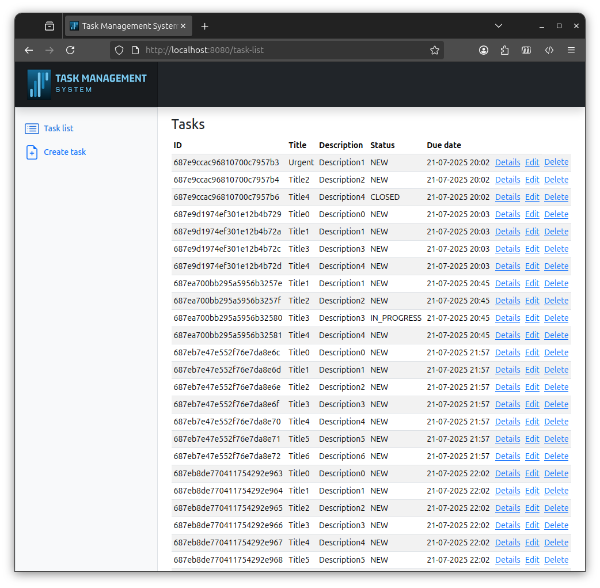
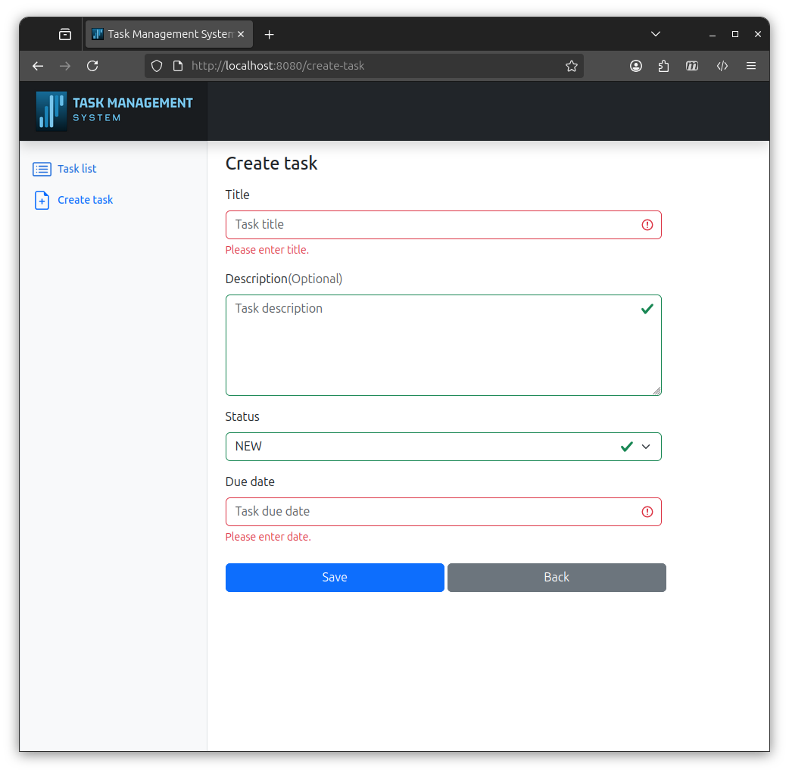
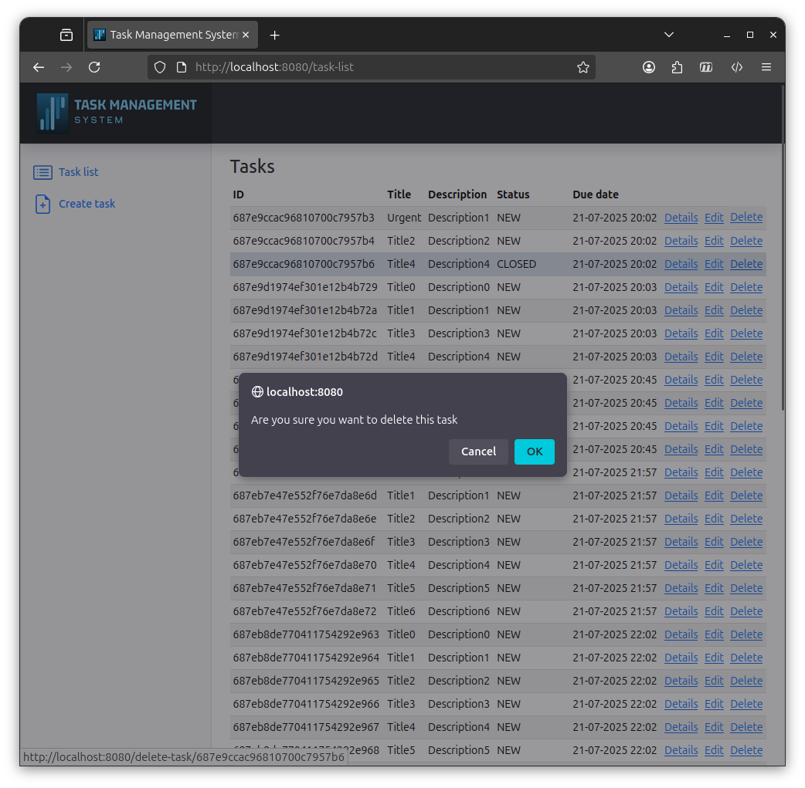

Task Management System
--


### Description
This is a simple project of a task management system that's composed of 3 separated components (3 tier):
* tms-backend responsible for the business layer. It exposes API via REST using Spring boot and Spring data
* tms-frontend responsible for the presentation layer using Spring boot, Thymeleaf views and Bootstrap
* MongoDB as a database

You can skip the rest of this document by clicking on this [demo video here](#demo-video) <br/>

### Usage
There are 2 ways to build and run the project on a preferred **Ubuntu** machine:
1. Simple way, using the provided docker compose file
2. Manual way, that requires just a bit of configuration

#### Simple way
Shown in [demo video](#demo-video) this requires that you have docker + compose plugin installed and docker group added so you can run it without sudo.<br/>
Run the following line on the root folder of the project to start all application 3 tiers:
````console
bash run-all.sh
````

#### Manual way
We first need to install MongoDB on our localhost using this link:
<a href="https://www.mongodb.com/docs/manual/tutorial/install-mongodb-on-ubuntu/">MongoDB Community Edition</a><br/>
Alternatively if you have docker installed it can be run with just 2 command lines:
````console
docker network create -d bridge my-net
docker run --name mongo --network=my-net -p 27017:27017 -d mongo:4.4.29
````
Once installed and up that is all for the DB, no need to set up any schema.<br/>
To configure tms-backend replace the following line in tms-backend/src/main/resources/application.properties with:
````properties
spring.data.mongodb.uri=mongodb://localhost:27017
````
To run tms-backend run the following line on the root folder of the project:
````console
./gradlew tms-backend:bootRun
````
We need to run the frontend now.<br/>
To configure tms-frontend replace the following line in tms-frontend/src/main/resources/application.properties with:
````properties
tms-backend-api-address=http://localhost:9090
````
We can see that the backend is exposing the REST API on **port:9090** to avoid any port conflicts.<br/>
To run tms-frontend run the following line on the root folder of the project:
````console
./gradlew tms-frontend:bootRun
````
That is all, everything should be up and running.


### Backend
Before going to the web interface we need to mention some useful links on the backend side.<br/>
REST API documentation is autogenerated here: http://localhost:9090/swagger-ui/index.html <br/>
OpenAPI is autogenerated here: http://localhost:9090/api-docs


If you ran the project using docker compose there a free MongoDB client named Mongo Express here: http://localhost:9091/ with credentials admin:pass<br/>
Here we can see the backend is generating some test data via **application.properties** with **generate-test-data=true**



### Frontend
Web interface can be accessed here: http://localhost:8080/

Validation of create/edit task is done client side via JS



### Final design notes
This project was done very simple and serves as a template for a quick 3 tier setup using spring boot.<br/>
It is not ready for production by any means as this iteration is missing some important features like:
* enabling https on both applications
* changing the REST endpoints name to include versioning as "v1"
* enabling spring security on both applications
* adding a login page
* adding pagination and sorting

> [!NOTE]
> The following ports need to be free on your machine for the application to work:
> 8080, 9090, 9091, 27017

> [!TIP]
> I case you have older JDK version than JDK 17 and you are using IntelliJIDEA as IDE make sure Gradle JVM is set to JDK 17 in:<br/>
> File | Settings | Build, Execution, Deployment | Build Tools | Gradle  -> Gradle JVM


### Demo video


